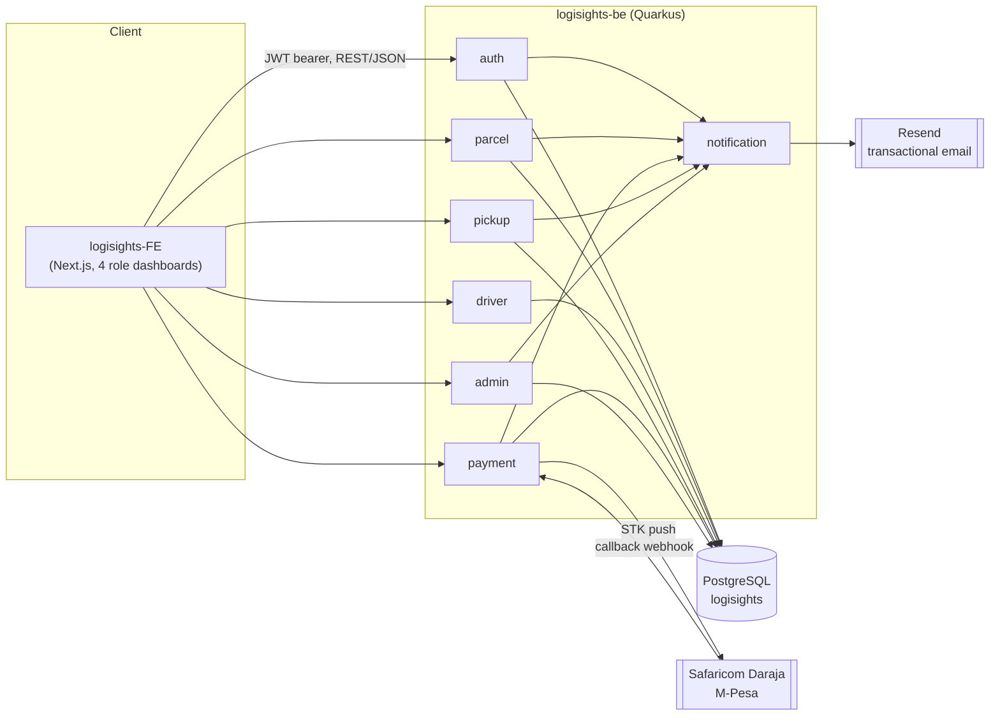
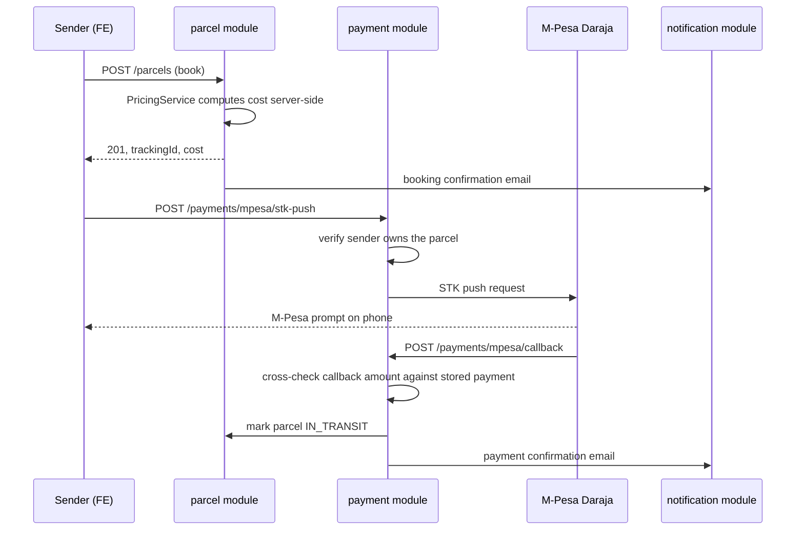

# Architecture

How `logisights-FE` and `logisights-be` fit together, and where the external providers sit.

## System diagram

## Request flow: booking a parcel and paying for it

## Why these boundaries

- **Modular monolith, not microservices.** One small team, one deployable, and the domain objects (`parcels`, `users`, `payments`) reference each other constantly; splitting them into services now would mean cross-service transactions for no operational benefit yet.
- **Auth: self-issued JWT via `smallrye-jwt`, not Keycloak.** A sibling project uses Keycloak, but that's a heavier fit for its case. Logisights has only 4 fixed roles (SENDER/DRIVER/PICKUP/ADMIN) and no SSO/enterprise-IdP requirement, so a Keycloak container plus realm/theme config would be overhead without payoff. Roles are carried as a JWT `groups` claim; `@RolesAllowed` on resources enforces them.
- **Email: Resend**, called via a thin typed REST client (`notification/client/ResendApi.java`) since Resend has no official Java SDK. Templates are Qute (`src/main/resources/templates/notification/`), with a shared base layout with header/footer partials, a dark-mode `prefers-color-scheme` CSS block, and a single `MailSender` interface so callers never talk to Resend directly.
- **Payments: M-Pesa (Safaricom Daraja)**, isolated entirely inside the `payment` package. Nothing outside that package knows Daraja-specific request/response shapes, so a second provider could be added later without touching `parcel` or `auth`.
- **Pricing is server-authoritative**: `parcel/service/PricingService.java` is the single place cost is computed (`base + per-kg x weight`), replacing the frontend's client-side calculation so a tampered client can't under-quote a delivery.
- **`payment` and `notification` are the only modules that talk to the outside world.** Daraja and Resend specifics stay inside those two packages so a second payment or email provider could be added without touching `parcel`, `auth`, or `admin`.
- **The frontend never talks to Postgres, Resend, or Daraja directly.** Everything goes through the Quarkus REST API, which is also where authorization (`@RolesAllowed`, ownership checks) and pricing integrity live, since the frontend is untrusted input.

## Module layout

Each module follows `resource` (JAX-RS) then `service` (business logic, `@Transactional` boundary) then `repository` (Panache) then `entity`. DTOs (records) sit at the resource boundary; entities never leak into JSON responses.

| Package | Owns | Notes |
|---|---|---|
| `auth` | `users`, `email_verification_tokens`, `password_reset_tokens` | Register/login/verify/reset. Tokens are stored as SHA-256 hashes only (`auth/service/TokenGenerator.java`); the raw token is emailed once. |
| `parcel` | `parcels`, `parcel_status_history` | Booking, tracking, status transitions, pricing. |
| `driver` | `driver_earnings` | Delivery task list (reuses `ParcelService`), earnings summary. |
| `pickup` | `pickup_points`, `pickup_inventory`, `pickup_activity_log` | Pickup-point inventory plus check-in/check-out log. |
| `payment` | `payments` | M-Pesa STK push plus callback webhook. |
| `notification` | (none) | Resend email client plus Qute templates. |
| `admin` | (none) | User management plus analytics endpoints. All stats are live SQL aggregates over the tables above (`admin/service/AdminService.java`), not separately stored. |
| `common` | (none) | Shared enums (`UserRole`, `ParcelStatus`, ...) and `ApiException`/`ApiExceptionMapper` for consistent JSON error bodies. |
