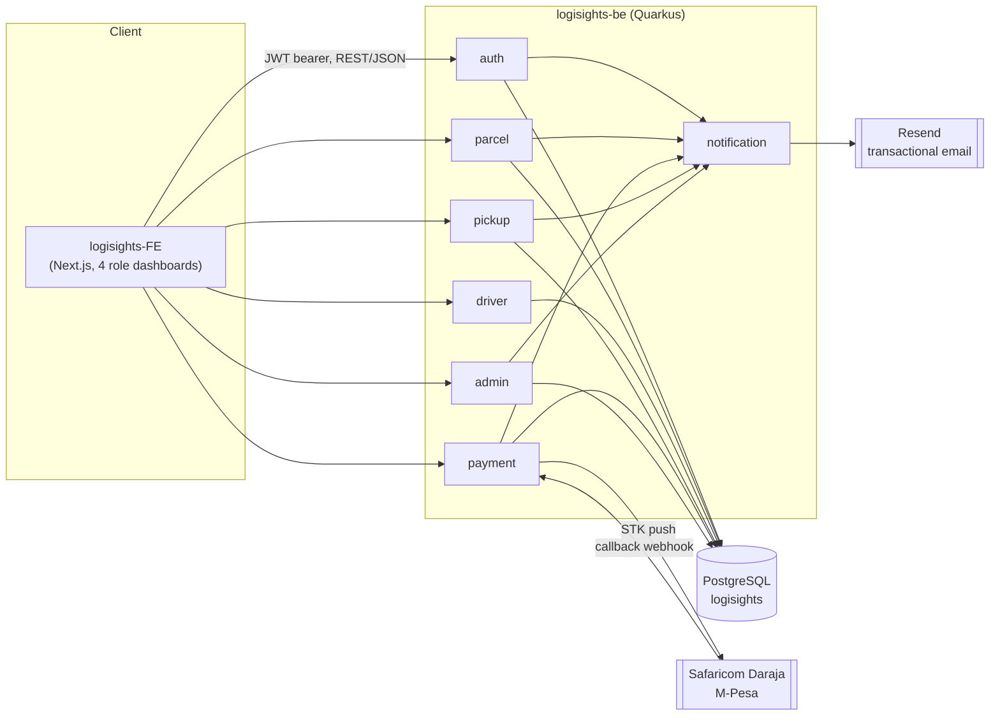
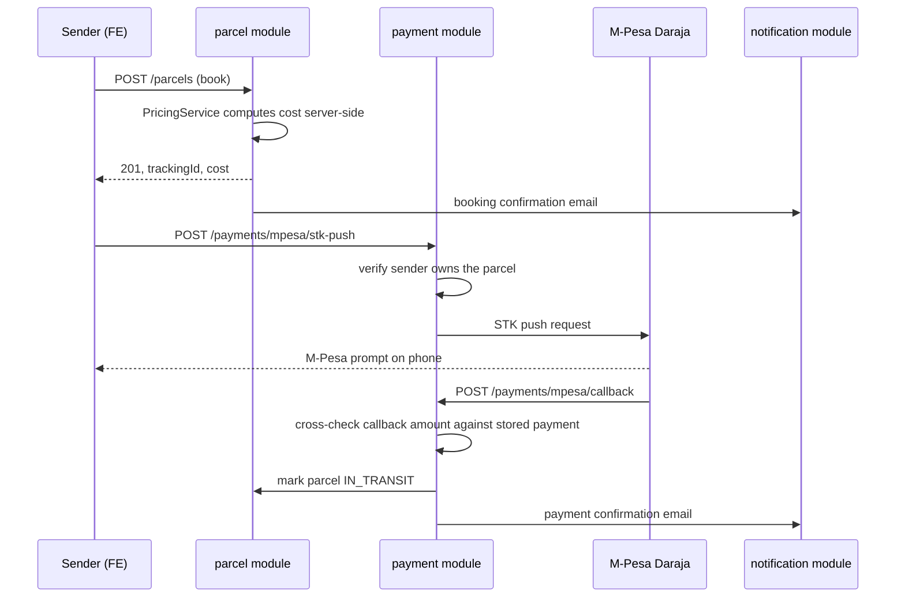

# Architecture

How `logisights-FE` and `logisights-be` fit together, and where the external providers sit.

## System diagram

## Request flow: booking a parcel and paying for it

## Why these boundaries

- **Modular monolith, not microservices.** One small team, one deployable, and the domain objects (`parcels`, `users`, `payments`) reference each other constantly; splitting them into services now would mean cross-service transactions for no operational benefit yet. See [CLAUDE.md](CLAUDE.md) for the full reasoning.
- **`payment` and `notification` are the only modules that talk to the outside world.** Daraja and Resend specifics stay inside those two packages so a second payment or email provider could be added without touching `parcel`, `auth`, or `admin`.
- **The frontend never talks to Postgres, Resend, or Daraja directly.** Everything goes through the Quarkus REST API, which is also where authorization (`@RolesAllowed`, ownership checks) and pricing integrity live, since the frontend is untrusted input.
